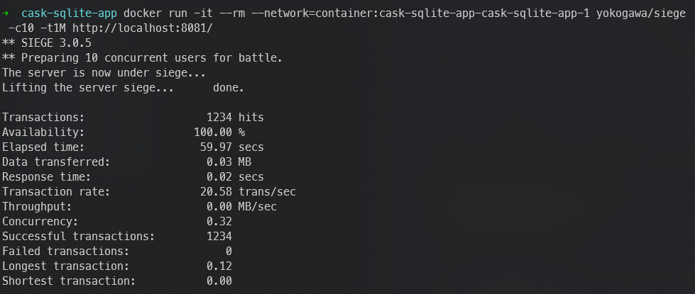
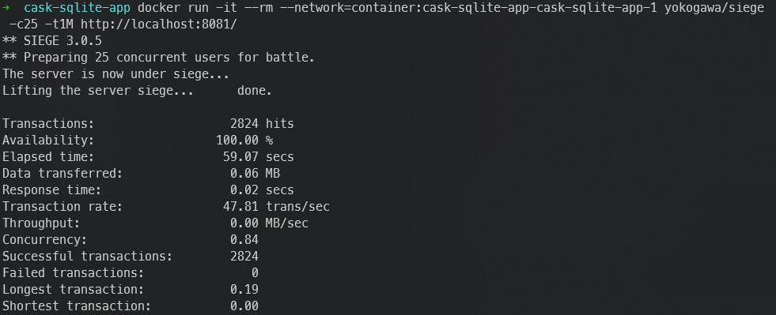
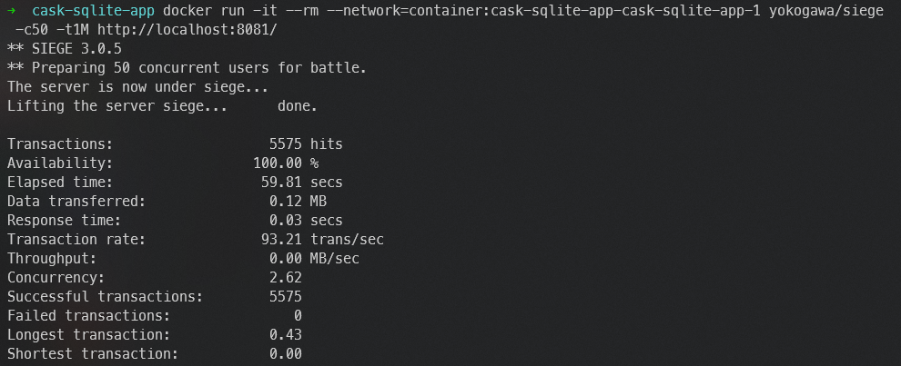
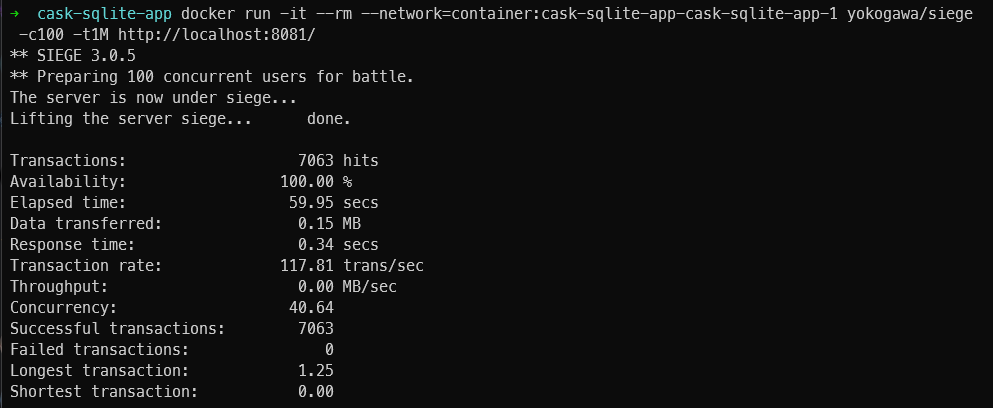
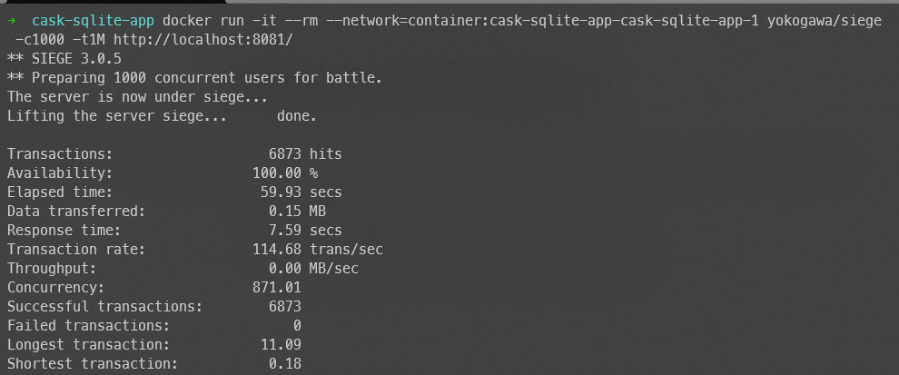

# Example Docker Compose project for [SQLite](https://www.sqlite.org/) and [siege](https://github.com/JoeDog/siege)

## Overview
This project is a Scala http server that saves data into SQLite, whenever the request is made. 

## Prerequisites
- Docker
- Docker Compose
- Bash Shell (for running scripts)

## Setup and Running Services

To get started, follow the steps below to set up your environment:

### Step 1: Compile Scala Application into Docker

Use the `mill` build tool to build your Scala application Docker image, then start up all services using Docker Compose.

```bash
./mill app.docker.build
docker compose up -d
```

This command will:
- Build the Docker image for the Scala application.
- Spin up the SQLite and Scala application.

### Step 2: Perform Stress Testing

1. Run it with 10 concurrent users:
    ```bash
    docker run -it --rm --network=container:cask-sqlite-app-cask-sqlite-app-1 yokogawa/siege -c10 -t1M http://localhost:8081/
    ```
   Result: 
2. Run it with 25 concurrent users:
    ```bash
    docker run -it --rm --network=container:cask-sqlite-app-cask-sqlite-app-1 yokogawa/siege -c25 -t1M http://localhost:8081/
    ```
   Result: 
3. Run it with 50 concurrent users:
    ```bash
    docker run -it --rm --network=container:cask-sqlite-app-cask-sqlite-app-1 yokogawa/siege -c50 -t1M http://localhost:8081/
    ```
   Result: 
4. Run it with 100 concurrent users:
    ```bash
    docker run -it --rm --network=container:cask-sqlite-app-cask-sqlite-app-1 yokogawa/siege -c100 -t1M http://localhost:8081/
    ```
   Result: 
5. Run it with 1000 concurrent users:
    ```bash
    docker run -it --rm --network=container:cask-sqlite-app-cask-sqlite-app-1 yokogawa/siege -c1000 -t1M http://localhost:8081/
    ```
   Result: 